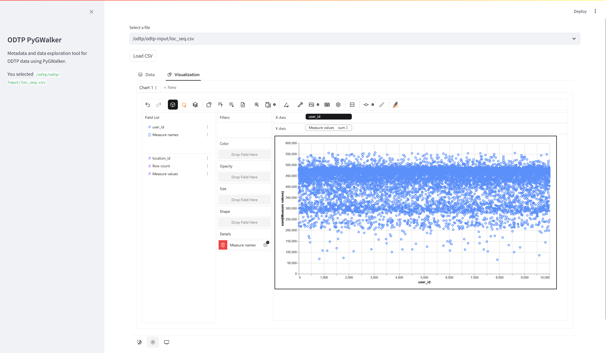

# odtp-pygwalker

CSV interactive visualization

| Tool Info | Links |
| --- | --- |
| Original Tool | [https://github.com/Kanaries/pygwalker-in-streamlit](https://github.com/Kanaries/pygwalker-in-streamlit) |
| Current Tool Version  | [commit-hash](link-to-commit-hash) |





## ODTP command 

```
odtp new odtp-component-entry \
--name odtp-pygwalker \
--component-version v0.1.4 \
--repository https://github.com/caviri/odtp-pygwalker
``` 

## Data sheet

### Parameters

No parameter

### Input Files

| File/Folder | Description |
| --- | --- | 
| *.csv | Any number of csv files |

### Output Files

No output

## Tutorial

### How to run this component as docker

1. Build the dockerfile 

```
docker build -t odtp-pygwalker .
```

2. Create a folder called `odtp-input` and place some `.csv` files inside.

3. Run the following command. Mount the correct volumes for input/output folders. 

```
docker run -it --rm \
-v $(pwd)/odtp-input:/odtp/odtp-input \
-v $(pwd)/odtp-output:/odtp/odtp-output \
-v $(pwd)/odtp-logs:/odtp/odtp-logs \
-p 8081:8081 \ 
--env-file .env odtp-pygwalker
```


## Changelog

- v0.1.4
    - Fix version pygwalker
    - ci github actions
    - Dockerfile compatible with Windows building


## Developed by

SDSC
